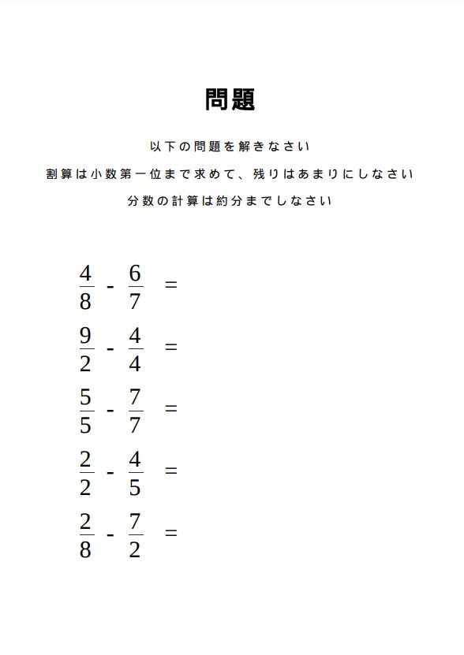

# 初等教育計算問題プリントの自動生成

今回は小学生の計算問題を自動で作成し、それをpdf化するまでを自動で行うプログラムを作成しました。

これは誰でも紙ベースの綺麗な問題プリントを手に入れられるようにするために作りました。
現在、問題の種類はversion1(2021/09/23)では限定的(割り算、掛け算、分数計算)ですが、小学生の弟の成長とともに今後追加していこうと考えています。

このプログラムは1ページに5問の計算問題を記載したpdfファイルを任意の枚数作成し、それらを1つのpdfに結合する処理を自動で行います。
したがって、最終的に複数ページのpdfファイルが1つ作成され、それをプリントアウトして使うことができます。


またhtmlファイルを単独で使うこともでき、更新すると問題は変わります。

## 環境
今回パッケージ化したものはubuntu20.04で動作確認しています。
windows環境には現在対応していません。

## 準備
```
python 3.8必須

sudo apt update
sudo apt install -y python3.8
sudo apt install python3.8-venv
```
## 使い方
以下のコマンドでは一度に10枚の作問を行うことができます。
```Numerical_Calculation_Generator/```で
```bash script/makePDF.sh (任意の出力フォルダ名)```を実行

任意の枚数を作問する際は
```Numerical_Calculation_Generator/```
で```bash script/makePDF.sh (任意の出力フォルダ名) (枚数)```を実行
## サンプル



## 更新
2021/12/23 ubuntu上で動かすことができるようにパッケージ化しました。

